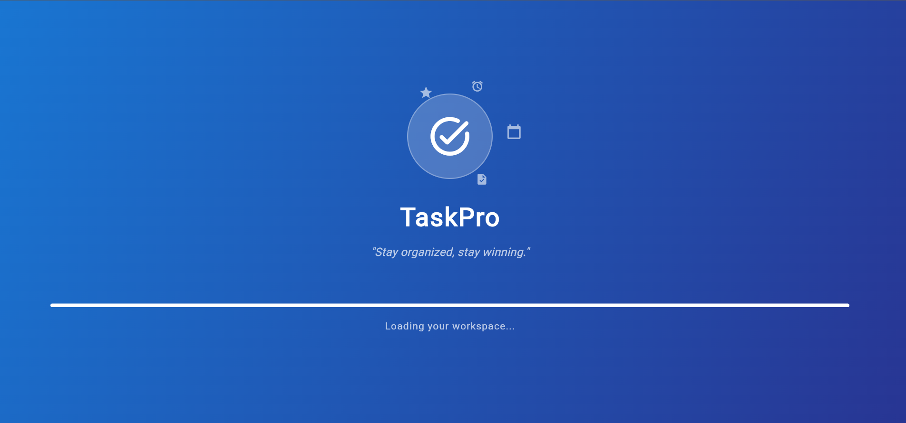
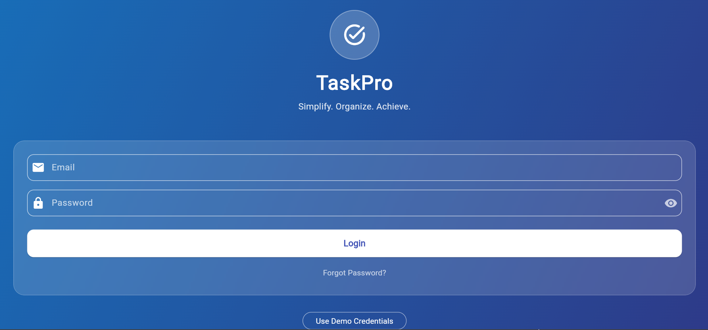
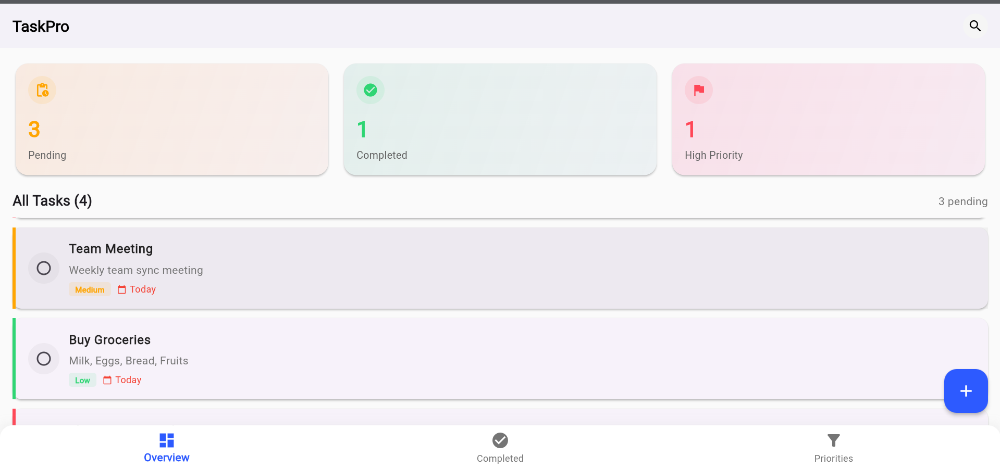
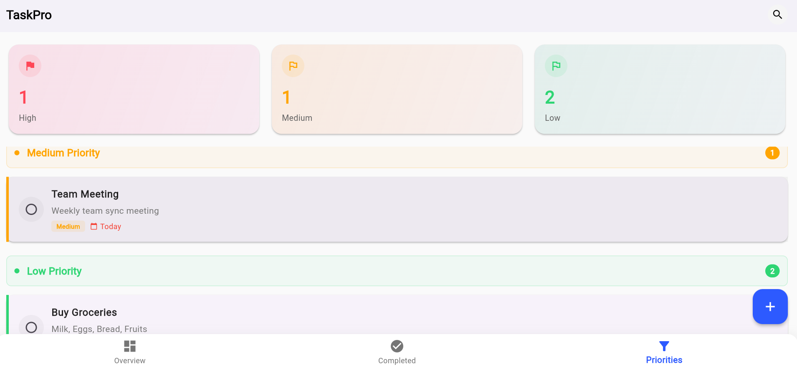
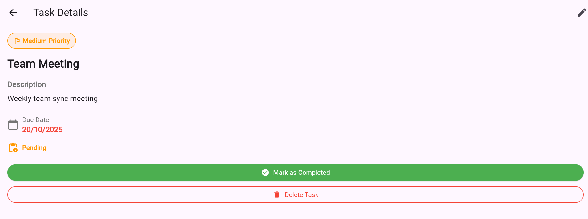

# 📝 TaskPro – Flutter App

## 📖 Project Overview

**TaskPro** is a Flutter-based mobile application designed to help users organize, track, and prioritize their daily tasks efficiently. It offers a simple and intuitive interface for managing assignments, work projects, or personal goals.

---

## 🎯 Purpose

To simplify daily task management by allowing users to:

- Create, edit, and delete tasks
- Categorize tasks based on priority
- Highlight tasks with approaching deadlines
- Filter and search for specific tasks

---

## 👥 Target Users

- **Learners/Students:** Manage assignments, study schedules, and deadlines
- **General Users/Professionals:** Organize daily routines and work-related tasks
- **Admins (Future Scope):** Monitor user productivity and manage app-level configurations

---

## ✨ Key Features

- ✅ Add, edit, delete tasks (CRUD operations)
- 🔢 Categorize tasks by **priority** (High, Medium, Low)
- ⏰ Highlight tasks with upcoming deadlines
- 🔍 Search and filter functionality
- 🧭 Navigation bar for easy access to sections
- 💻 Cross-platform (Android & iOS) support
- 🎨 Clean and minimal UI design

---

## 🏗️ Project Structure

```
lib/
├── main.dart
└── screens/
    ├── home_screen.dart
    ├── login_screen.dart
    ├── splash_screen.dart
    ├── task_detail_screen.dart
    └── task_list_screen.dart
```

---

## 📱 App Screenshots

### Splash Screen



*Initial loading screen with app branding*

---

### Login Screen



*User authentication interface*

---

### Home Screen



*Main dashboard displaying tasks organized by priority*

---

### Task List Screen



*Comprehensive view of all tasks with filtering options*

---

### Task Detail Screen



*Detailed view of individual tasks with edit/delete options*

---

## 🧩 Short User Journeys

### 👩‍🎓 Learner Example:

1. Adds a task: "Web Design Assignment – Due Friday"
2. Sets priority: **High**
3. Sees it highlighted under the *High Priority* category

### 👨‍💼 General User Example:

1. Adds tasks like "Buy groceries," "Pay bills," and "Team meeting at 3 PM"
2. Sorts tasks by due date
3. Marks completed tasks as done

---

## 🖼️ Wireframe Designs

To be created using **Figma** or **Whimsical**.

**Screens include:**

1. Login Screen
2. Home Screen (Tasks by priority)
3. Add/Edit Task Screen
4. Task Details Screen

---

## 🧠 Learning Outcomes

By completing this project, learners will:

- Define app purpose and user roles clearly
- Create UI wireframes and plan app navigation
- Gain hands-on experience with Flutter setup and GitHub
- Lay the groundwork for functional UI screens in later weeks

---

## 💻 GitHub Repository Setup

**Repository Name:** `task_pro`

**Initial Setup Includes:**

- Flutter project folder structure
- `README.md` (this document)
- At least one commit/push showing version control activity

---

## 🚀 Getting Started

### Prerequisites

- Flutter SDK (v3.0.0 or higher)
- Dart SDK
- Android Studio / VS Code with Flutter extensions
- Git

### Installation

1. Clone the repository:
   ```bash
   git clone https://github.com/yourusername/taskpro_flutter_app.git
   ```

2. Navigate to the project directory:
   ```bash
   cd taskpro_flutter_app
   ```

3. Install dependencies:
   ```bash
   flutter pub get
   ```

4. Run the app:
   ```bash
   flutter run
   ```

---


## 🎨 Project Vision

TaskPro aims to provide an all-in-one personal productivity solution for managing daily tasks efficiently while maintaining a clean and distraction-free user experience.

---

## 🧭 Navigation Flow

```
Login → Home (All Tasks | Completed | Upcoming)
  ↓
Add/Edit Task → Save → Home
  ↓
View Details → Edit/Delete
```

---

## 🛠️ Technologies Used

- **Framework:** Flutter
- **Language:** Dart

- **Version Control:** Git & GitHub

---

## 📝 Future Enhancements

- 🔔 Push notifications for task reminders
- 🌙 Dark mode support
- 📊 Analytics dashboard for productivity tracking
- ☁️ Cloud sync across devices
- 👥 Collaborative task sharing

---

## 🤝 Contributing

Contributions are welcome! Please follow these steps:

1. Fork the repository
2. Create a feature branch (`git checkout -b feature/AmazingFeature`)
3. Commit your changes (`git commit -m 'Add some AmazingFeature'`)
4. Push to the branch (`git push origin feature/AmazingFeature`)
5. Open a Pull Request

---

## 📄 License

This project is licensed under the MIT License - see the LICENSE file for details.

---


## 🙏 Acknowledgments

- Flutter community for excellent documentation
- All contributors who help improve this project


