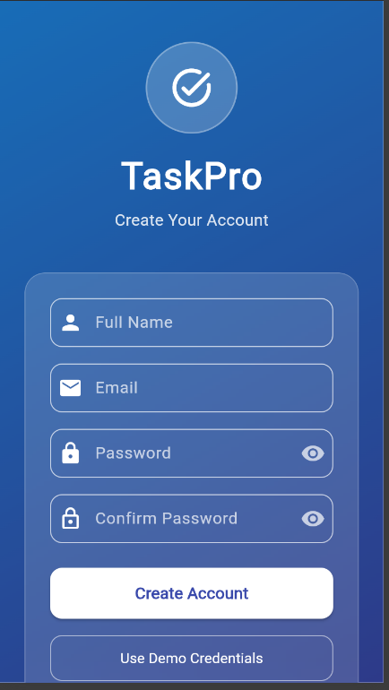

# 📝 TaskPro – Flutter App

## 📖 Project Overview

**TaskPro** is a Flutter-based mobile application designed to help users organize, track, and prioritize their daily tasks efficiently. It offers a simple and intuitive interface for managing assignments, work projects, or personal goals with full CRUD (Create, Read, Update, Delete) functionality powered by JSON data storage.

---

## 🎯 Purpose

To simplify daily task management by allowing users to:

- Create, edit, and delete tasks
- Categorize tasks based on priority
- Mark tasks as complete or pending
- Search and filter tasks efficiently
- Manage user authentication and personal task lists

---

## 👥 Target Users

- **Learners/Students:** Manage assignments, study schedules, and deadlines
- **General Users/Professionals:** Organize daily routines and work-related tasks
- **Admins (Future Scope):** Monitor user productivity and manage app-level configurations

---

## ✨ Key Features

- ✅ Full CRUD operations (Create, Read, Update, Delete tasks)
- 🔐 User authentication (Login & Signup with validation)
- 🔢 Categorize tasks by **priority** (High, Medium, Low)
- ✔️ Mark tasks as **Complete** or **Pending**
- 🔍 Search and filter functionality
- 📝 Task detail view with edit capabilities
- 🧭 Navigation bar for easy access to sections
- 💻 Cross-platform (Android & iOS) support
- 🎨 Clean and minimal UI design
- 📡 JSON-based data storage and API connectivity

---

## 🏗️ Project Structure

```
lib/
├── main.dart
├── screens/
│   ├── home_screen.dart
│   ├── login_screen.dart
│   ├── signup_screen.dart
│   ├── splash_screen.dart
│   ├── task_detail_screen.dart
│   └── task_list_screen.dart
└── services/
    ├── auth_service.dart
    └── task_service.dart
```

---

## 🚀 How to Run the Application

### **Prerequisites**
- Flutter SDK installed on your machine
- Node.js and npm installed (for JSON Server)
- A code editor (VS Code recommended)
- Chrome or any web browser

### **Step 1: Clone the Repository**
```bash
git clone https://github.com/azmi-adan/task_pro
cd taskpro
```

### **Step 2: Install Flutter Dependencies**
```bash
flutter pub get
```

### **Step 3: Start the JSON Server (Backend)**
Open a **new terminal window** and run:
```bash
npx json-server --watch db.json --port 3000
```

**Important:**
- This command starts your mock backend API on port 3000
- Keep this terminal running while using the app
- The server will use the `db.json` file in your project root
- You should see output like: `Resources: http://localhost:3000/tasks`

### **Step 4: Run the Flutter Application**
Open **another terminal window** and run:
```bash
flutter run -d web-server
```

**Alternative commands for different platforms:**
```bash
flutter run -d chrome        # Run in Chrome browser
flutter run -d edge          # Run in Edge browser  
flutter run                  # Run on connected device/emulator
```

### **Step 5: Use the Application**
1. The app will open automatically in your browser
2. You'll see the **Splash Screen** first
3. Navigate to **Signup** to create a new account
4. Or click **Login** if you already have an account
5. Start managing your tasks!

---

## 📁 JSON Server Configuration

### **Available API Endpoints**
Once JSON Server is running on `http://localhost:3000`, you can use:

- **Tasks:**
  - `GET http://localhost:3000/tasks` - Get all tasks
  - `GET http://localhost:3000/tasks/:id` - Get single task
  - `POST http://localhost:3000/tasks` - Create new task
  - `PUT http://localhost:3000/tasks/:id` - Update task
  - `DELETE http://localhost:3000/tasks/:id` - Delete task

- **Users:**
  - `GET http://localhost:3000/users` - Get all users
  - `POST http://localhost:3000/users` - Create new user

---

## 🧭 User Navigation Guide

### **For New Users (Signup Flow)**

1. **Launch App** → Splash Screen displays
2. **Click "Sign Up"** → Navigate to Signup Screen
3. **Fill Registration Form:**
   - Email: Enter valid email (e.g., user@example.com)
   - Password: Minimum 6 characters
   - Confirm Password: Must match password
4. **Submit Form** → Account created successfully
5. **Auto-redirect** → Home Screen

### **For Existing Users (Login Flow)**

1. **Launch App** → Splash Screen displays
2. **Click "Login"** → Navigate to Login Screen
3. **Enter Credentials:**
   - Email address
   - Password
4. **Click Login Button** → Authenticated
5. **Redirect** → Home Screen

---

## 📱 Using the Home Screen

### **View All Tasks**
- All your tasks are displayed in a scrollable list
- Each task shows: Title, Description, Priority, Status

### **Add a New Task**
1. Click the **"+ Add Task"** floating button
2. Fill in the form:
   - **Title:** Task name (required)
   - **Description:** Task details
   - **Priority:** Select High/Medium/Low
   - **Due Date:** Pick from calendar
3. Click **"Save"**
4. Task appears in your list instantly

### **Search for Tasks**
1. Use the **search bar** at the top
2. Type keywords (searches title and description)
3. Results filter in real-time

### **Mark Task as Complete/Pending**
1. Tap on any task card
2. Opens **Task Detail Screen**
3. Toggle the status switch
4. Status updates immediately

### **Edit a Task**
1. Tap on the task to open details
2. Click **"Edit"** button
3. Modify any field you want
4. Click **"Save Changes"**
5. Updated task appears in list

### **Delete a Task**
1. Open the task detail screen
2. Click **"Delete"** button
3. Confirm deletion in dialog
4. Task removed from list

---

## 🔄 Week 3 Updates

### **What Changed This Week:**

#### **1. JSON & API Integration**
- Connected all screens to JSON Server backend
- Replaced hardcoded data with real API calls
- Implemented proper data fetching in `task_service.dart`

#### **2. Forms with Validation**
- **Signup Form:** Email format validation, password strength check, confirm password matching
- **Login Form:** Required field validation, credential verification
- **Task Form:** Title validation, priority selection, date picker

#### **3. Error Handling & Loading States**
- Loading spinners during API calls
- Error messages for failed operations
- Success notifications
- Network error handling

---

## 📦 Required Dependencies

Add these to your `pubspec.yaml`:

```yaml
dependencies:
  flutter:
    sdk: flutter
  http: ^1.1.0              # For API calls
  provider: ^6.0.0          # State management
  intl: ^0.18.0             # Date formatting
```

Run `flutter pub get` after adding dependencies.

---

## 🔮 Future Enhancements

- Cloud database integration (Firebase/Supabase)
- Push notifications for task reminders
- Dark mode theme
- Task categories and tags
- Collaborative task sharing
- Data export (PDF/CSV)
- Recurring tasks feature

---

## 📱 App Screenshots

### Splash Screen


*Initial loading screen with app branding*

---

### Login Screen


*User authentication interface*

---

### Home Screen


*Main dashboard displaying tasks organized by priority*

---

### Task List Screen


*Comprehensive view of all tasks with filtering options*

---

### Task Detail Screen


*Detailed view of individual tasks with edit/delete options*

---
signup screen 


## 🏁 Week 4 Final Updates

### ✅ Key Improvements
- Fixed all backend issues related to task ID type conflicts.
- Resolved **Signup screen validation and form submission issue** to ensure smooth account creation.
- Fixed **CRUD operation issues**, including editing, deleting, and marking tasks as complete.
- Implemented stable CRUD functionality for tasks.
- Enhanced UI consistency and navigation flow.
- Added loading indicators and success/error feedback.
- Improved validation in all forms (Login, Signup, Task Form).

### 🧩 Optional Feature Added
- Added a **Feedback Form** screen to collect user comments and suggestions.

### 📹 Demo Video
🎥 Watch the short app walkthrough: [Demo video : https://drive.google.com/file/d/1zZbvcTu-wJVWoaryNBvp1Q5hRqQQ3Utk/view?usp=sharing](#)


## 💻 GitHub Repository Setup

**Repository Name:** `task_pro`

**Initial Setup Includes:**

- Flutter project folder structure
- `README.md` (this document)
- At least one commit/push showing version control activity

---

## 🚀 Getting Started

### Prerequisites

- Flutter SDK (v3.0.0 or higher)
- Dart SDK
- Android Studio / VS Code with Flutter extensions
- Git

### Installation

1. Clone the repository:
   ```bash
   git clone https://github.com/azmi-adan/task_pro
   ```

2. Navigate to the project directory:
   ```bash
   cd task_pro
   ```

3. Install dependencies:
   ```bash
   flutter pub get
   ```

4. Run the app:
   ```bash
   flutter run
   ```

---


## 🎨 Project Vision

TaskPro aims to provide an all-in-one personal productivity solution for managing daily tasks efficiently while maintaining a clean and distraction-free user experience.

---


---

## 🛠️ Technologies Used

- **Framework:** Flutter
- **Language:** Dart

- **Version Control:** Git & GitHub

---

---

## 🤝 Contributing

Contributions are welcome! Please follow these steps:

1. Fork the repository
2. Create a feature branch (`git checkout -b feature/AmazingFeature`)
3. Commit your changes (`git commit -m 'Add some AmazingFeature'`)
4. Push to the branch (`git push origin feature/AmazingFeature`)
5. Open a Pull Request

---

## 📄 License

This project is licensed under the MIT License - see the LICENSE file for details.

---


## 🙏 Acknowledgments

- Flutter community for excellent documentation
- All contributors who help improve this project


